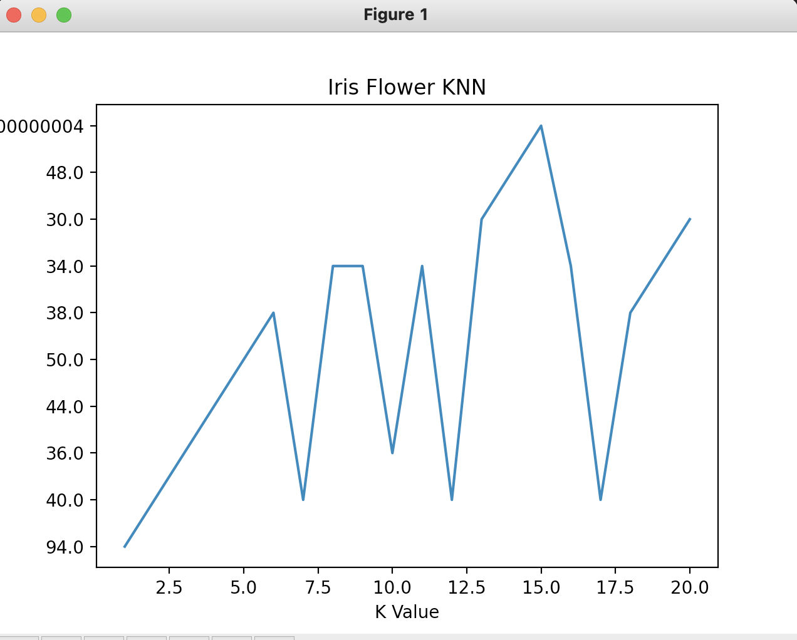

# Homework 1

#### **Team member names:**

**_Owen Senowitz_**----
senowitzo19@students.ecu.edu

**_James Kinlaw_**------
kinlawj19@students.ecu.edu

**_Tyler Blue_**------------
bluet19@students.ecu.edu

The iris data set that contains 150 records of three species of Iris flowers, Iris Setosa , Iris Virginica and Iris Versicolor is being used in this algorithm.
We use 50 records for each Iris species and every record contains four features, the pedal length and width, the sepal length and width. We are going to classify the four features
using the K-Nearest-Neighbor algorithm

Attributes:
Sepal length, sepal width, petal length, petal width and the class.(all measured in cm)

Languages and Tools used:
Python3

Jupyter Notebook

#### **Important Libraries:**

1. pandas
2. random
3. math
4. matplotlib

**Model accuracy:**
94%

K=1 is the optimal number of nearest neighbors with an accuracy of 94%

