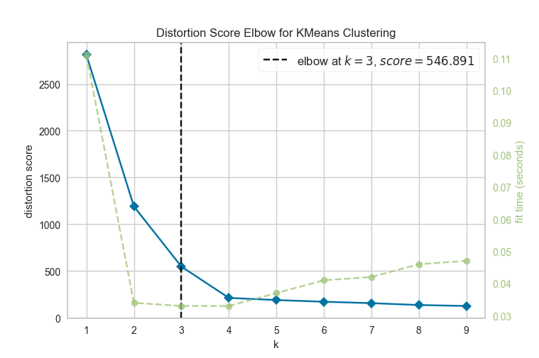

# Homework 2

#### **Team member names:**

**_Owen Senowitz_**----
senowitzo19@students.ecu.edu

**_James Kinlaw_**------
kinlawj19@students.ecu.edu

**_Tyler Blue_**------------
bluet19@students.ecu.edu

### **Quick Start:**

1. Install Important Libraries down below
2. Run the file with Python 3

You can comment out the functions at the bottom of the hw2.py file in order to select different sections to run.

#### **Important Libraries:**

1. sklearn
2. yellowbrick
3. matplotlib

