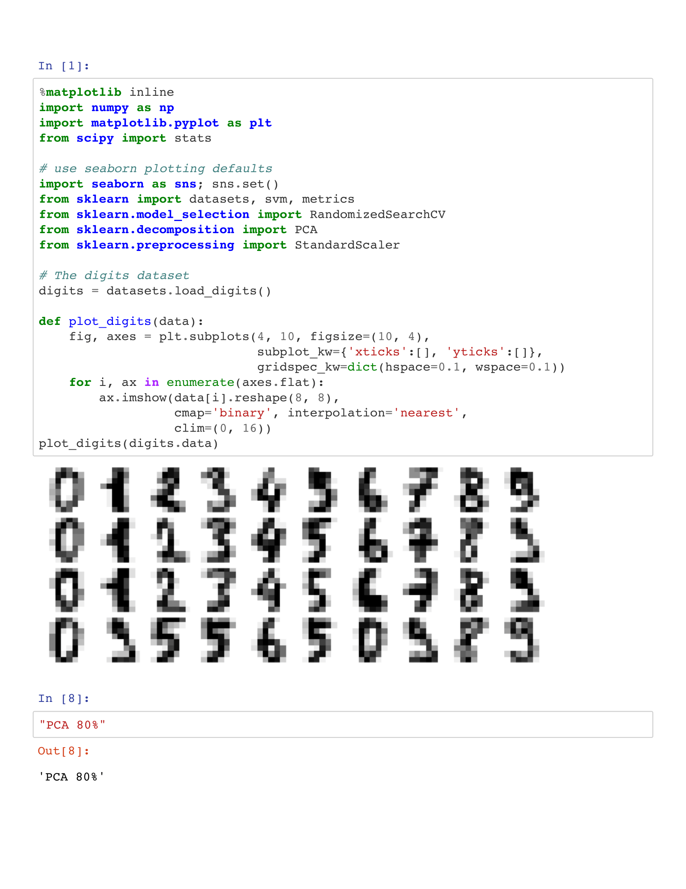
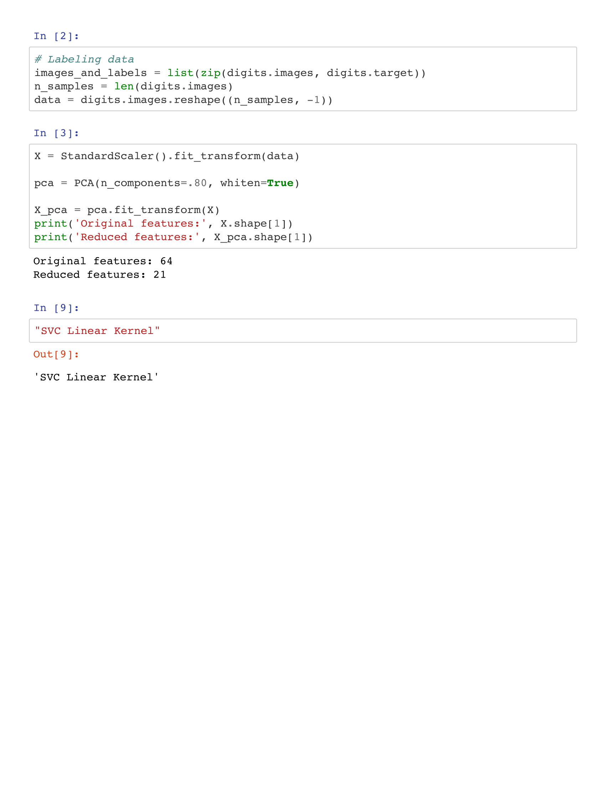
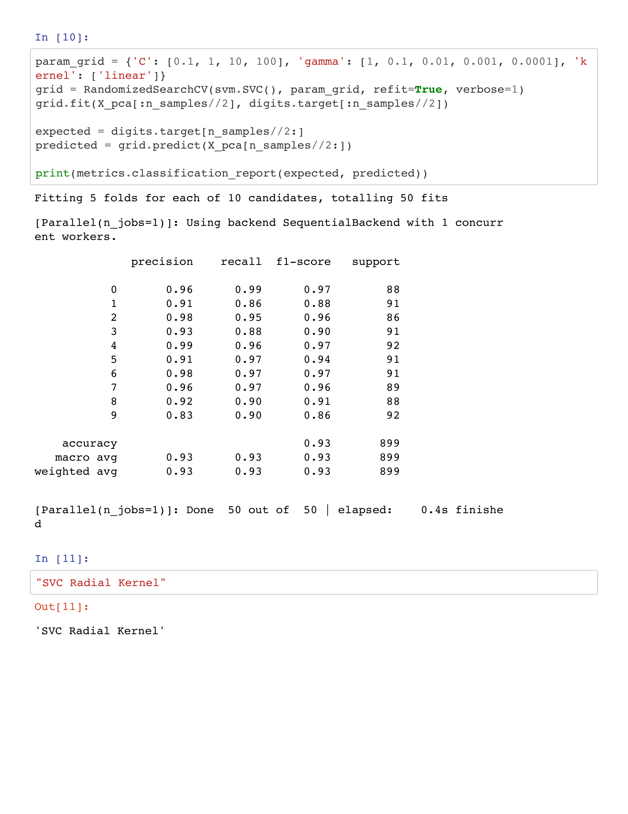
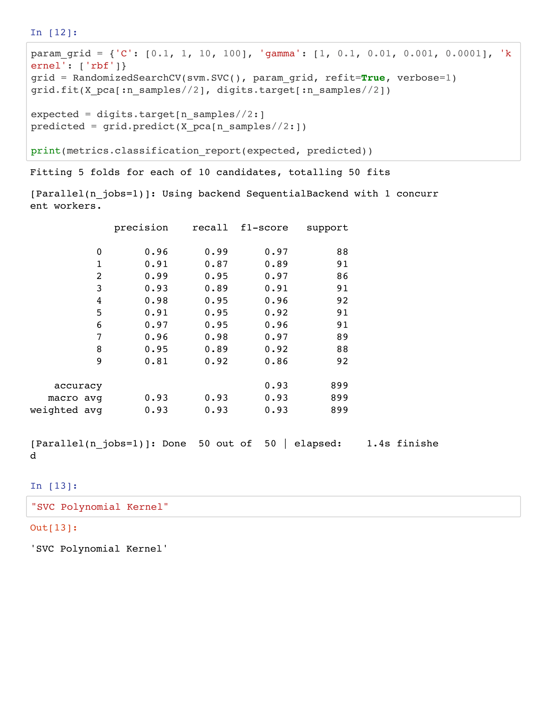
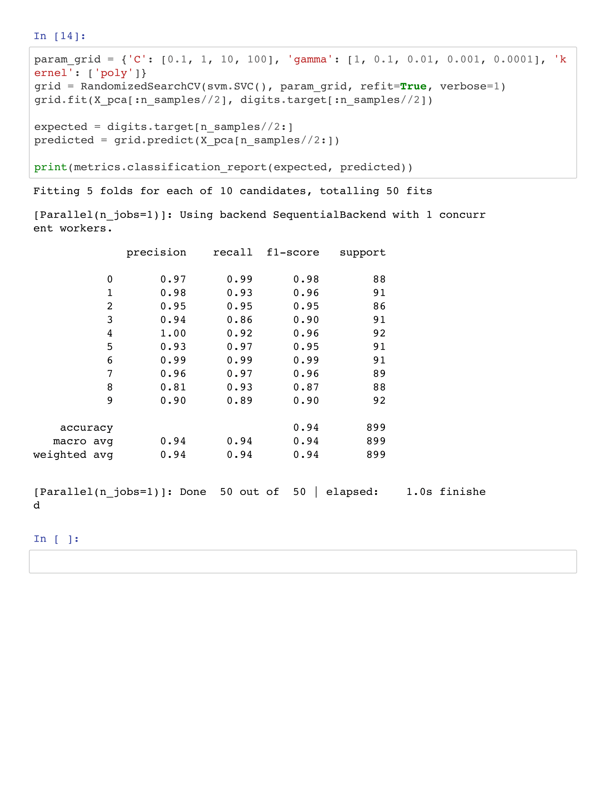

# Homework 6

This project is intended to classify digits with SVM models,
use PCA to reduce data dimensionality (80% information remain),
to compare performance of linear, radial, and polynomial kernals
and tune kernal parameters using Randomsearch method.

From the output above:
linear kernel = 93 %
Polynomial kernel = 94%
Radial = 93%.
Hence, the polynomial kernel is more accurate when compared to linear and radial.

#### **Team member names:**

**_Owen Senowitz_**----
senowitzo19@students.ecu.edu

**_James Kinlaw_**------
kinlawj19@students.ecu.edu

**_Tyler Blue_**------------
bluet19@students.ecu.edu

